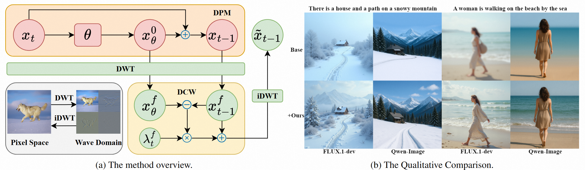

# [CVPR 2026] Elucidating the SNR-t Bias of Diffusion Probabilistic Models

Diffusion Probabilistic Models have demonstrated remarkable performance across a wide range of generative tasks. However, we have observed that these models often suffer from a Signal-to-Noise Ratio–timestep (SNR-t) bias. This bias refers to the misalignment between the SNR of the denoising sample and its corresponding timestep during the inference phase. Specifically, during training, the SNR of a sample is strictly coupled with its timestep. However, this correspondence is disrupted during inference, leading to error accumulation and impairing the generation quality. We provide comprehensive empirical evidence and theoretical analysis to substantiate this phenomenon and propose a simple yet effective differential correction method to mitigate the SNR-t bias. Recognizing that diffusion models typically reconstruct low-frequency components before focusing on high-frequency details during the reverse denoising process, we decompose samples into various frequency components and apply differential correction to each component individually. Extensive experiments show that our approach significantly improves the generation quality of various diffusion models (IDDPM, ADM, DDIM, A-DPM, EA-DPM, EDM, PFGM++, and FLUX) on datasets of various resolutions with negligible computational overhead.

## Overview


This is the codebase for our paper **Elucidating the SNR-t Bias of Diffusion Probabilistic Models (CVPR 2026)**.
The repository is heavily based on [EDM](https://github.com/NVlabs/edm). For environment setup, datasets preparation, pre-trained models loading, and fid calculation, please refer to the official EDM code [repository](https://github.com/NVlabs/edm). 

## Requirements
After setting up the environment required for the EDM base model, you also need to install the packages related to wavelet transform.
```python
pip install pytorch_wavelets 
pip install PyWavelets
```
## Introduction
Now, we integrate the Differential Correction in Wavelet domain (DCW) into the EDM base model.

(1) Import the required packages.
```python
from pytorch_wavelets import DWTForward, DWTInverse
```

(2) Define DWT and IDWT. 
```python
dwt = DWTForward(J=1, mode='zero', wave='haar').cuda()
iwt = DWTInverse(mode='zero', wave='haar').cuda()
```
Moreover, it is possible to employ different wavelet bases, for instance, db4 and sym8.

(3) Define various correction functions.
```python
def dcw_pix(x,y,scaler):
	......
		
def dcw_low(x, y, scaler):
    x = x.to(torch.float32)
    y = y.to(torch.float32)
    xl, xh = dwt(x)
    yl, yh = dwt(y)
    xl = xl + scaler * (xl - yl)
    x_new = iwt((xl, xh))
    return x_new
			
def dcw_high(x, y, scaler):
	......
	    
def dcw_double(x, y, low_scaler, high_scaler):
	......
```
(4) Apply the correction function.

Low-frequency correction, as shown in Eqs.18 and 20 of our paper.
```python
x_next = dcw_low(x_next, denoised, (t_steps[i] / sigma_max) * corr_scaler)
```
## FLUX-DCW
Here, we provide the core code for FLUX-DCW. More specifically, we only need to modify the step function in FlowMatchEulerDiscreteScheduler. Simply perform the following operations in sequence to run the code successfully:

(1) First, we assume that you are already able to directly use [FLUX](https://huggingface.co/black-forest-labs/FLUX.1-dev) for image generation. 

(2) Then, please install the wavelet transform-related libraries via the commands: pip install pytorch_wavelets and pip install PyWavelets. 

(3) Finally, you directly replace your FlowMatchEulerDiscreteScheduler with the one we provide, and pass in the parameter scaler by yourself to run it successfully.

# Contact
If you have any questions, feel free to contact the first author. (Email: `mengyu23@sjtu.edu.cn`)

## Citation
```
@article{yu2026eluci,
  title={Elucidating the SNR-t Bias of Diffusion Probabilistic Models},
  author={Meng Yu and Lei Sun and Jianhao Zeng and Xiangxiang Chu and Kun Zhan},
  journal={arXiv preprint arXiv:2604.16044},
  year={2026}
}
```
